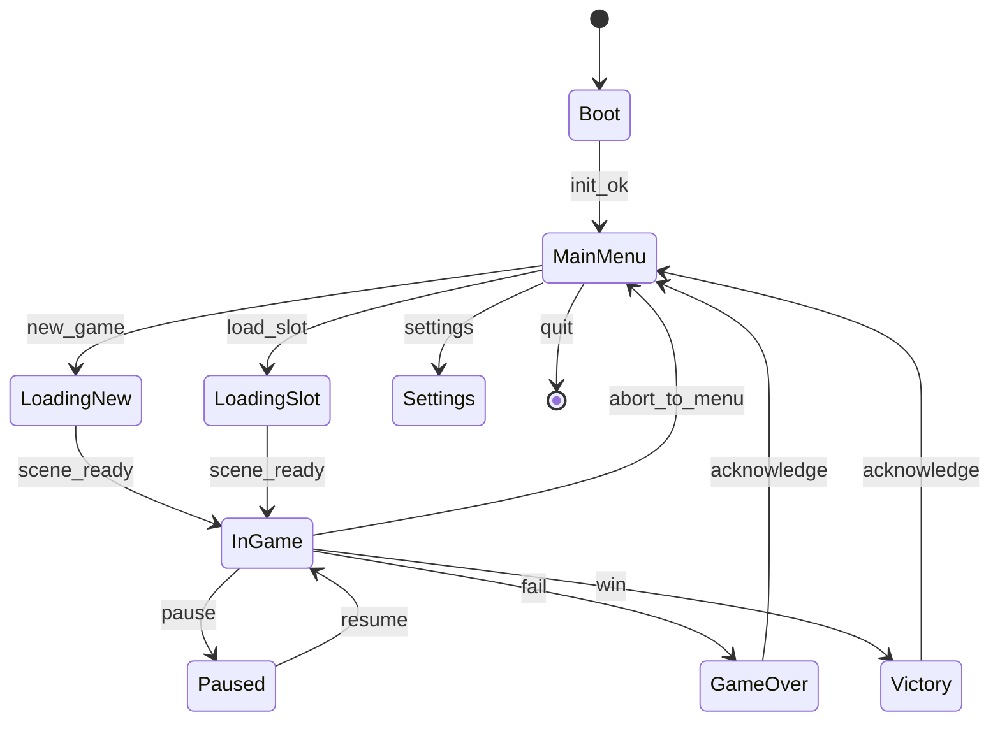

# 遊戲層技術設計（TDD）— WeaveBound 對照

本文件描述**遊戲專案**（相對於引擎倉庫）的主流程、狀態資料邊界、存檔 v0 與引擎模組依賴。引擎細節仍以 [WEAVEBOUND_SPEC.md](../WEAVEBOUND_SPEC.md) 與 [docs/ADR/](../ADR/) 為準。

## 1. 與引擎的邊界

| 層級 | 責任 | WeaveBound 對應 |
|------|------|----------------|
| 遊戲 app | 狀態機、關卡流程、存檔內容、玩法規則 | `apps/weavebound_game_prototype/`（可複製為正式專案） |
| 引擎 | 視窗、輸入底層、RHI、ECS、資產 IO、Job | `game_engine_core`、`weavebound_*` 函式庫 |
| 共用契約 | 存檔 blob 版本、可序列化欄位 | `weavebound::game::save_v0`（見 §4） |

遊戲**不得**在玩法程式碼中直接 `#include <vulkan/vulkan.h>`；渲染需求經 `rhi::IDevice` 與後續 Renderer API。

## 2. 遊戲狀態機（v0）

- **堆疊**：Pause 壓在 InGame 上；從 Paused 返回只彈一層。
- **Boot**：載入設定、初始化 `Application`、可選顯示公司 Logo（時間盒）。
- **Loading\***：非阻塞載入由 Job + VFS 回呼驅動（見 §3）；此階段不接收遊戲輸入或僅接收「取消」。

## 3. 場景切換時保留的資料

| 資料類別 | 進入 InGame 時 | 離開 InGame 回主選單 | 全關閉 app |
|----------|----------------|----------------------|------------|
| `GameInstance`（隨機種子、難度） | 保留 | 保留 | 可選寫入設定 |
| 玩家進度（血量、位置、背包） | 由新關卡初始化或讀檔 | 若未存檔則丟棄或提示 | — |
| 關卡執行時狀態（敵人、機關） | 每關重新載入 | 釋放 | 釋放 |
| 全域任務／旗標（跨關） | 從存檔或預設表載入 | 保留在記憶體直至回主選單不重載 | 可寫檔 |
| ECS `World`（關卡內） | `LoadScene` 重建 | `UnloadScene` 清空 | 清空 |

**規則**：跨關持久化只經 **存檔分塊** 或明確的 `GameInstance` 欄位；關卡內 ECS 不當作長期真實來源。

## 4. 存檔格式 SaveGame v0

二進位、小端序、分塊（chunk），便於日後加欄位與向後相容。

- **檔頭**（固定）：`magic`（`WBVS`）、`format_version`（`1`）、`flags`（保留 `0`）、`header_crc32`（見下）。
- **本文**：`chunk_count`，接續 `chunk_count` 個 **Chunk**：`chunk_id`（`u32`）、`payload_size`（`u32`）、`payload`（`payload_size` 位元組）。
- **校驗**：`header_crc32` 為 **CRC-32 / IEEE**（與 PNG/Ethernet 相同多項式）針對「檔頭中 magic/version/flags 之後到檔尾」的連續位元組（即 chunk 區整段）計算。

**Chunk ID（v0 註冊表）**

| ID | 名稱 | 說明 |
|----|------|------|
| `0x504C4159` `'PLAY'` | Player | 玩家狀態：`health_f32`、`level_u32`、`pos_x_f32`、`pos_y_f32`、`level_id_u32`（payload 20 bytes；舊版 8 bytes 仍可由 decode 讀取） |
| `0x574F524C` `'WORL'` | WorldFlags | `pair_count` + `pair_count * (u32 key, u32 value)` |
| `0x51535453` `'QSTS'` | QuestStub | `active_quest_id_u32`、`step_index_u32`（8 bytes）；可選 chunk |

實作與 round-trip 測試：`weavebound::game::save_v0`（[save_game_v0.hpp](../../engine/include/weavebound/game/save_game_v0.hpp)）。

## 5. 每幀更新順序（遊戲掛鉤）

在 `Application::tick` **之後**、呈現 **之前**（若啟用繪圖）建議順序：

1. 輸入：自 **`IWindow::read_input(InputState&)`**（Win32 已實作鍵／滑鼠 held 與增量）→ **Action Map** 解析（見 [0004-input-action-map.md](../ADR/0004-input-action-map.md)）→ 遊戲命令佇列。
2. 遊戲狀態機：`GameFlow::update(dt)`。
3. ECS Systems（依註冊順序）：物理固定步在 `Application::fixed_update` 或等價呼叫內。
4. Renderer：僅讀 ECS Query／相機，不掃描全域 list（對齊 ADR 0003 方向）。

## 6. 輸入：Action Map 與 rebind（規劃）

見 ADR **0004**。現況 [input.hpp](../../engine/include/weavebound/platform/input.hpp) 為型別占位；遊戲層應依 ADR 定義 **邏輯動作 ID** 與 **綁定表檔案格式**（JSON 建議），不硬編 VK 碼在玩法程式碼。

## 7. 與 A–J 功能清單的對照（backlog）

| 區塊 | TDD 階段 |
|------|-----------|
| A 主流程 | §2–§3（本檔） |
| B 玩家 | Action map + ECS PlayerController（程式在 game app） |
| C AI | 導航／感知後續 Epic；狀態機可先表驅動 |
| D 戰鬥 | Hitbox、技能資料表，依賴固定步長物理 |
| E 物品 | 表 + Inventory component，對齊資產 GUID |
| F 任務 | Quest chunk 擴充、事件匯流排（game app 內） |
| G UI | 與引擎 ImGui 除錯分離；runtime UI 見 SPEC §1.9 |
| H 音效 | Mixer bus、BGM 狀態機（ADR 後續） |
| I 存檔 | §4 + `ISaveSystem` 實作可包一層 slot 路徑 |
| J 平衡 | 表驅動、cook 產物，禁止硬編大表 |

---

**版本**：與 `save_v0.format_version` 獨立；本 TDD 文件以 Git 歷史與 PR 說明演進。
